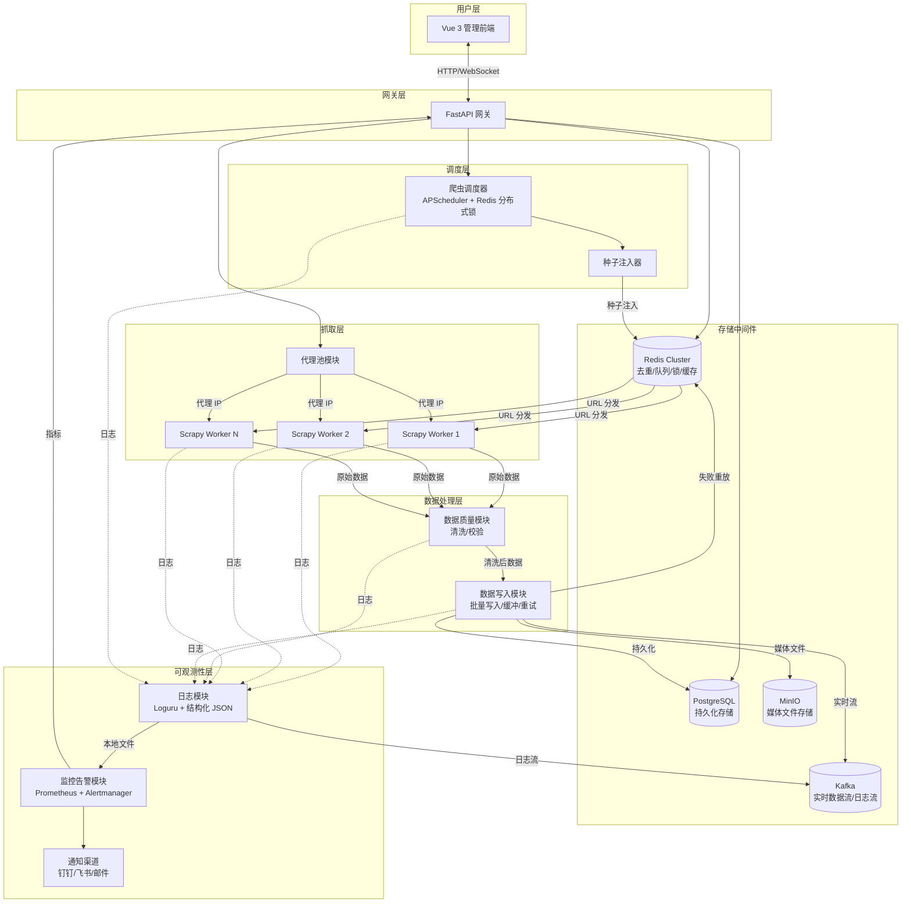

# AIspider 分布式爬虫框架 — 架构设计文档

> 基于 Python 3.12 | 日均千万级数据抓取 | 多机分布式部署

---

## 一、设计目标

1. 使用 Git 做代码管理，便于更新迭代
2. 支持 docker-compose 一键部署
3. 支持热更新（Spider 代码 + 配置）
4. 日均千万级数据抓取能力
5. 多机器部署统一日志，每个爬虫携带 `spider_id`，支持全链路追踪与日志聚合检索

---

## 二、整体数据流

```text
种子注入 -> Redis(去重 + 优先级队列) -> Scrapy Workers(代理池支撑)
    -> 数据质量(清洗校验) -> 数据写入模块
        |- Kafka (实时流)
        |- PostgreSQL (持久化)
        |- MinIO (媒体文件)
        '- Redis 死信队列 (失败重放)

全链路日志 -> Kafka 日志流 + 本地文件 -> 监控告警 -> 多渠道通知
API 网关 + Vue 3 <- 统一管理入口
```

---

## 三、系统架构图



---

## 四、模块划分

原 11 个模块调整为基础设施层 + 10 个业务模块：

| 编号 | 模块 | 职责 |
|---|---|---|
| - | infra（基础设施层） | 连接池管理、健康检查、Prometheus 指标定义、统一配置 |
| 1 | seed | Redis 去重 + 种子分发 |
| 2 | proxy | 代理池 |
| 3 | spider | Scrapy 分布式抓取 + BaseSpider + Pipelines |
| 4 | logger | Loguru 结构化日志 + Kafka 远程日志 |
| 5 | writer | 数据写入（PG + Kafka + MinIO） |
| 6 | quality | 数据清洗与校验 |
| 7 | monitor | 监控告警（Kafka 消费 + Prometheus） |
| 8 | scheduler | APScheduler 调度 + 任务运行态管理 |
| 9 | api | FastAPI 网关（HTTP + WebSocket） |
| 10 | frontend | Vue 3 爬虫管理前端 |

---

## 五、基础设施层（infra）

基础设施层不是独立业务模块，而是所有模块的公共依赖，负责连接池统一管理、健康检查、Prometheus 指标定义和配置管理。

### 5.1 连接池统一管理

- 统一管理 Redis / PostgreSQL / Kafka / MinIO
- 应用启动时 `startup()` 初始化，退出时 `shutdown()` 清理
- Kafka 启动带重试，适配容器编排启动顺序

### 5.2 健康检查

- 并发探测 Redis/PostgreSQL/Kafka/MinIO
- 返回组件状态、延迟、异常细节
- API 对外提供健康端点供 Dashboard 与巡检使用

### 5.3 统一配置

- 使用 `pydantic-settings`
- 所有环境变量以 `AISPIDER_` 为前缀
- 支持生产环境敏感配置强校验

---

## 六、关键链路设计

### 6.1 任务调度链路

1. API 写任务配置到 Redis `scheduler:tasks`
2. API 推送命令到 `scheduler:commands`
3. scheduler 消费命令并执行任务
4. 任务执行核心动作是注入种子到 `queue:{spider_name}`

### 6.2 抓取与写入链路

1. worker 消费 Redis 队列
2. spider 抓取并交给 pipelines
3. quality 清洗/校验
4. writer 输出到 PostgreSQL/Kafka/MinIO
5. 失败写入死信或隔离表

### 6.3 观测与告警链路

1. Loguru 输出结构化日志
2. sink 分发到 Kafka 与 Redis PubSub
3. monitor 消费 Kafka 日志并按规则告警
4. API 通过 WebSocket 推送日志与实时状态

---

## 七、部署与运行

推荐以 `docker-compose.yml` 编排单机环境：

- 状态组件：Redis、PostgreSQL、Kafka、MinIO
- 应用组件：api、scheduler、spider-worker、monitor、proxy-refiller
- 接入组件：nginx、frontend
- 观测组件：prometheus、grafana

---

## 八、非功能设计

### 8.1 可靠性

- scheduler 使用 Redis leader 锁，避免多主调度
- 命令幂等键防止重复执行
- 日志与写入链路具备重试与背压策略

### 8.2 安全性

- JWT + RBAC 访问控制
- 数据查询接口白名单 + 参数化 SQL
- 生产环境敏感配置强校验

### 8.3 可观测性

- Prometheus 指标全链路埋点
- Dashboard 组件健康可视化
- 告警滑窗聚合抑制告警风暴

---

## 九、后续演进建议

1. 将告警规则从关键词升级为可配置规则引擎
2. 引入更细粒度的任务运行指标与 SLA
3. 完善测试体系，消除历史遗留无效用例
4. 代理池扩展为多供应商策略

